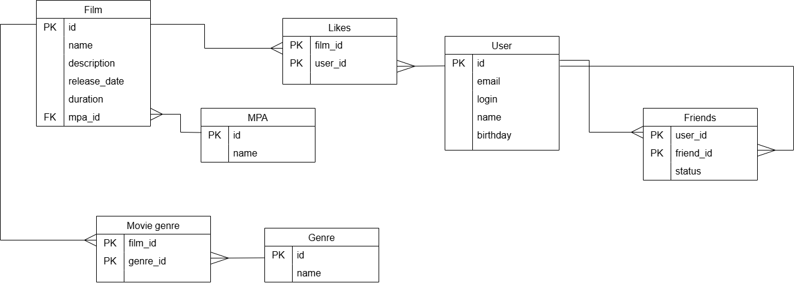

# Filmorate

Социальная сеть для киноманов. Приложение позволяет пользователям:
- Добавлять фильмы и управлять ими
- Ставить лайки фильмам
- Добавлять друг друга в друзья
- Находить популярные фильмы
- Находить общих друзей

---

## Схема базы данных



---

## Описание таблиц

### Film
Хранит информацию о фильмах.

| Поле | Тип | Описание |
|------|-----|----------|
| id | INT | Уникальный идентификатор (PRIMARY KEY) |
| name | VARCHAR(255) | Название фильма |
| description | VARCHAR(200) | Описание фильма |
| release_date | DATE | Дата релиза |
| duration | INT | Продолжительность в минутах |
| mpa_id | INT | ID рейтинга MPA (FOREIGN KEY → MPA.id) |

### MPA (Motion Picture Association)
Справочник возрастных рейтингов.

| Поле | Тип | Описание |
|------|-----|----------|
| id | INT | Уникальный идентификатор (PRIMARY KEY) |
| name | VARCHAR(10) | Название рейтинга (G, PG, PG-13, R, NC-17) |

### Genre
Справочник жанров фильмов.

| Поле | Тип | Описание |
|------|-----|----------|
| id | INT | Уникальный идентификатор (PRIMARY KEY) |
| name | VARCHAR(50) | Название жанра |

### Movie Genre
Связующая таблица для связи фильмов и жанров (многие-ко-многим).

| Поле | Тип | Описание |
|------|-----|----------|
| film_id | INT | ID фильма (PRIMARY KEY, FOREIGN KEY → Film.id) |
| genre_id | INT | ID жанра (PRIMARY KEY, FOREIGN KEY → Genre.id) |

### User
Хранит информацию о пользователях.

| Поле | Тип | Описание |
|------|-----|----------|
| id | INT | Уникальный идентификатор (PRIMARY KEY) |
| email | VARCHAR(255) | Email пользователя |
| login | VARCHAR(255) | Логин пользователя |
| name | VARCHAR(255) | Имя пользователя |
| birthday | DATE | Дата рождения |

### Likes
Хранит лайки пользователей на фильмы.

| Поле | Тип | Описание |
|------|-----|----------|
| film_id | INT | ID фильма (PRIMARY KEY, FOREIGN KEY → Film.id) |
| user_id | INT | ID пользователя (PRIMARY KEY, FOREIGN KEY → User.id) |

### Friends
Хранит связи дружбы между пользователями.

| Поле | Тип | Описание |
|------|-----|----------|
| user_id | INT | ID пользователя (PRIMARY KEY, FOREIGN KEY → User.id) |
| friend_id | INT | ID друга (PRIMARY KEY, FOREIGN KEY → User.id) |
| status | VARCHAR(20) | Статус дружбы (PENDING, CONFIRMED) |

---


### Описание связей:
- **Film → MPA**: Многие фильмы могут иметь один рейтинг (многие-к-одному)
- **Film → Genre**: Многие фильмы могут иметь много жанров (многие-ко-многим) через таблицу Movie Genre
- **Film → User**: Многие пользователи могут лайкать многие фильмы (многие-ко-многим) через таблицу Likes
- **User → User**: Многие пользователи могут дружить с многими пользователями (многие-ко-многим) через таблицу Friends

---

## Примеры SQL-запросов

### Фильмы

#### Получить все фильмы
```sql
SELECT * FROM film;
```

#### Получить фильм по ID
```sql
SELECT * FROM film WHERE id = ?;
```

#### Получить все жанры фильма
```sql
SELECT g.id, g.name
FROM genre g
JOIN movie_genre mg ON mg.genre_id = g.id
WHERE mg.film_id = ?;
```

#### Получить рейтинг фильма (MPA)
```sql
SELECT m.id, m.name AS rating
FROM mpa m
JOIN film f ON f.mpa_id = m.id
WHERE f.id = ?;
```

#### Получить топ-10 популярных фильмов по лайкам
```sql
SELECT f.id, f.name, COUNT(l.user_id) AS likes_count
FROM film f
LEFT JOIN likes l ON l.film_id = f.id
GROUP BY f.id, f.name
ORDER BY likes_count DESC
LIMIT 10;
```

#### Получить топ-N популярных фильмов
```sql
SELECT f.id, f.name, COUNT(l.user_id) AS likes_count
FROM film f
LEFT JOIN likes l ON l.film_id = f.id
GROUP BY f.id, f.name
ORDER BY likes_count DESC
LIMIT ?;
```

### Пользователи

#### Получить всех пользователей
```sql
SELECT * FROM user;
Получить пользователя по ID
sql
SELECT * FROM user WHERE id = ?;
```

### Друзья

#### Получить всех друзей пользователя (подтвержденных)
```sql
SELECT u.*
FROM user u
JOIN friends f ON f.friend_id = u.id
WHERE f.user_id = ? AND f.status = 'CONFIRMED';
```

#### Получить общих друзей двух пользователей
```sql
SELECT u.*
FROM user u
JOIN friends f1 ON f1.friend_id = u.id AND f1.status = 'CONFIRMED'
JOIN friends f2 ON f2.friend_id = u.id AND f2.status = 'CONFIRMED'
WHERE f1.user_id = ? AND f2.user_id = ?;
```

#### Добавить друга (создать заявку)
```sql
INSERT INTO friends (user_id, friend_id, status) 
VALUES (?, ?, 'PENDING');
```

#### Получить всех пользователей, лайкнувших фильм
```sql
SELECT u.id, u.login, u.name
FROM user u
JOIN likes l ON l.user_id = u.id
WHERE l.film_id = ?;
```

#### Получить количество лайков у фильма
```sql
SELECT COUNT(*) AS likes_count
FROM likes
WHERE film_id = ?;
```
